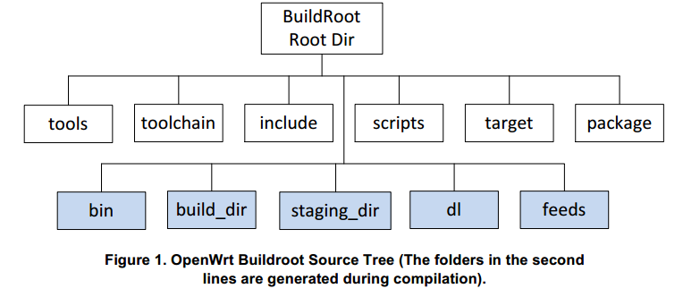
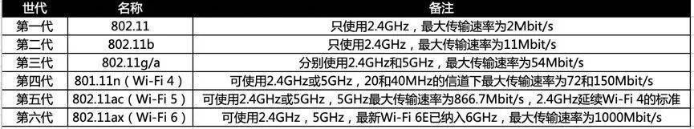

## openwrt

### 目录结构




上图是openwrt目录结构，其中第一行是原始目录，第二行是编译过程中生成的目录。各目录的作用是：

tools - 编译时需要一些工具， tools里包含了获取和编译这些工具的命令。里面是一些Makefile，有的可能还有patch。每个Makefile里都有一句 \$(eval \$(call HostBuild))，表示编译这个工具是为了在主机上使用的。

toolchain - 包含一些命令去获取kernel headers, C library, bin-utils, compiler, debugger

target - 各平台在这个目录里定义了firmware和kernel的编译过程。

package - 包含针对各个软件包的Makefile。openwrt定义了一套Makefile模板，各软件参照这个模板定义了自己的信息，如软件包的版本、下载地址、编译方式、安装地址等。

include - openwrt的Makefile都存放在这里。

scripts - 一些perl脚本，用于软件包管理。

dl - 软件包下载后都放到这个目录里

build_dir - 软件包都解压到build_dir/里，然后在此编译

staging_dir - 最终安装目录。tools, toolchain被安装到这里，rootfs也会放到这里。

feeds - 扩展软件包索引目录

bin - 编译完成之后，firmware和各ipk会放到此目录下。

tmp - 编译文件夹, 一般情况为空.

### 编译

1. 整体编译

    ```
    make V=s
    ```

    镜像目录: release

2. 编译模块

    ```
    make package/xxx/clean V=99
    make package/xxx/compile V=99
    make package/xxx/install V=99
    ```

    一般第一次整体编译之后，后续编译就很快了

    单编模块后，在编译完成后在SDK目录下的/bin/[xxx]/package/base文件夹下会有编译出来的ipk文件，将ipk文件传到设备上，使用如下命令安装


    安装模块使用命令：`opkg install xxx.ipk`

ref :  
[Openwrt 22.03编译及移远4G/5G模组驱动移植编译](https://baijiahao.baidu.com/s?id=1746671372715034944&wfr=spider&for=pc)


### 模块

#### 内核模块

ref :  
[演示编译OpenWrt内核驱动模块](https://blog.51cto.com/u_15346415/5224049)

#### 上层模块

ref :  
[openwrt简单ipk生成及Makefile解释](https://www.cnblogs.com/chengyi818/p/4774043.html)
 

示例：
使用配置区分两个产品，通过编译选项传入不同的两个宏来编译不同的代码

```
package/tool
         ├─Makefile
         └─src
             ├─helloworld.c
             └─Makefile
```

## json 

json(JavaScript object Notation)是一种轻量级的数据交换格式，易于人读写，也易于机器解析和生成。json是一种独立于编程语言之外的文本格式，兼容多种编程语言，如c、c++、Java、JavaScript、perl、Python等。

json的字符串只能用双引号，使用反斜线转义，单个字符即为一个单独的字符串，json的数值没有使用八进制与十六进制格式,json的空为null

json由key:value组成

1. string  
格式是key:value，value为字符串；
object是一个name/vale对，格式是{name:value}，相当于c语言中的结构体、哈希表等。

2. number  
格式是key:value，value为整数；

3. boolean  
格式是key:value，value为true或者false；

4. object  
object相当于c语言中中的结构体，格式是key:{key1:value1,key2:value2,…}，value可以是string、number、boolean、object或者array；

5. array  
array相当于c语言中的数组，格式是key:[value1,value2,…]，value可以是string、number、boolean、object或者array。

```json
{
    str : "abc",
    obj : {
        str1 : "hubei",
        num : 123,
        bol : true 
    },
    arr : ["aaa", 3, false],
    test : null
}
```

## uci

ref :  
<https://www.freesion.com/article/3823154192/>

uci文件语法

```uci
config 'section-type' 'section'
        option  'key'       'value'
        list    'list_key'  'list_value'
config 'example' 'test'
        option  'string'        'some value'
        option  'boolean'       '1'
        list    'collection'    'first item'
        list    'collection'    'second item'
```

语法解释
+ config 节点：以关键字 config 开始的一行用来代表当前节点

    + 节点语法格式： `config 'section-type' 'section'`
    
        ```  
        section-type 节点类型  
        section 节点名称
        ```
    + config节点原则：  
        允许只有节点类型的匿名节点存在  
        节点类型和名字建议使用单引号包含以免引起歧义  
        节点中可以包含多个 option 选项或 list 列表选项。  
        节点遇到文件结束或遇到下一个节点代表完成。  

+ option 选项：表示节点中的一个元素

    + 选项语法格式：`option 'key' 'value'`  

        ```
        key 键  
        value 值  
        ```

    + option 选项原则：  
        选项的键与值建议使用单引号包含  
        避免相同的选项键存在于同一个节点,否则只有一个生效

+ list 列表选项：表示列表形式的一组参数

    + 列表选项语法格式：`list 'list_key' 'list_value'`

        ```
        list_key 列表键  
        list_value 列表值
        ```

    + list 列表选项原则  
        选项的键与值建议使用单引号包含  
        列表键的名字如果相同,则相同键的值将会被当作数组传递给相应软件	

参数说明

```
Commands:
        batch
        export     [<config>]
        import     [<config>]
        changes    [<config>]
        commit     [<config>]
        add        <config> <section-type>
        add_list   <config>.<section>.<option>=<string>
        del_list   <config>.<section>.<option>=<string>
        show       [<config>[.<section>[.<option>]]]
        get        <config>.<section>[.<option>]
        set        <config>.<section>[.<option>]=<value>
        delete     <config>[.<section>[[.<option>][=<id>]]]
        rename     <config>.<section>[.<option>]=<name>
        revert     <config>[.<section>[.<option>]]
        reorder    <config>.<section>=<position>
 
Options:
        -c <path>  set the search path for config files (default: /etc/config)
        -d <str>   set the delimiter for list values in uci show
        -f <file>  use <file> as input instead of stdin
        -m         when importing, merge data into an existing package
        -n         name unnamed sections on export (default)
        -N         don't name unnamed sections
        -p <path>  add a search path for config change files
        -P <path>  add a search path for config change files and use as default
        -q         quiet mode (don't print error messages)
        -s         force strict mode (stop on parser errors, default)
        -S         disable strict mode
        -X         do not use extended syntax on 'show'
```

修改完后需要执行uci commit命令,才会将修改的内容同步到/etc/config下的文件

| 函 数             |	含 义  |
| :-:               |  :-:    |
| uci_alloc_context | 分配UCI上下文环境对象 |
| uci_free_context 	| 释放UCI上下文环境对象 
| uci_load 	        | 解析UCI配置文件，并存储到UCI对象中。@name:配置文件名，相对于配置目录。@package:在这个变量中存储装载的配置包 |
| uci_unload 	    | 从UCI上下文环境对象中unload配置文件 |
| uci_lookup_ptr 	| 分割字符串并查找。@ptr:查找的结果。@str:待查找的字符串，但 str 不能为常量， 因为将被修改赋值，在 ptr 变量内部会被使用到，因此 str 的寿命必须至少和 ptr 一样长。@extended 是否允许扩展查找 |
| uci_set 	        | 设置元素值，如果必要将创建一个元素。更新或创建的元素将存储在ptr-> last中 |
| uci_delete 	    | 删除一个元素，配置节或选项 |
| ci_save 	        | 保存一个package修改的delta |
| uci_commit 	    | 提交更改package，提交将重新加载整个uci_package |
| uci_set_confdir 	| 修改UCI配置文件的存储位置，默认为/etc/config |

## blob & blobmsg

ref :  
<https://www.freesion.com/article/17181317275/>  
<https://openwrt.org/docs/techref/ubus>

json数据转blob，再转为uci格式

```json
{
    "mac" : "00:00:00:BE:CD:00",
    "2.4g" : {
        "enable" : 0,
        "channel" : 0,
        "power" : 0
    },
    "5g" : {
        "enable" : 0,
        "channel" : 0,
        "power" : 0
    }
}
```

```h
/**
 * 从data BLOGMSG串中根据policy策略过滤，得到的结果存储在tb blob_attr数组中
 *
 * @param  policy 过滤策略
 * @param  policy_len 策略个数
 * @param  tb 返回属性数据
 * @param  len 属性个数
 * @param  data 属性个数
 */
int blobmsg_parse(const struct blobmsg_policy *policy, int policy_len,
                  struct blob_attr **tb, void *data, unsigned int len)
```
blobmsg根节点是一个纯粹的blob，所以blobmsg解析时需要注意： 

+ 第一层解析，data必须取值为blob_data(root_blob)，len必须取值为blob_len(root_blob)

+ 第二层及以上解析，data必须取值为blobmsg_data(sub_blob)，len必须取值为blobmsg_data_len(sub_blob)

所以，应避免混合使用blob和blobmsg语义，比如第一层使用blob语义，第二层使用blobmsg语义。

```cpp
// 定义policy
enum {
    SET_WIFI_MAX,
    SET_WIFI_RADIO2,
    SET_WIFI_RADIO5,
    SET_WIFI_POLICY_MAX
}

static const struct blobmsg_policy set_wifi_policy[SET_WIFI_POLICY_MAX] = {
    [SET_WIFI_MAX]      = { .name = "mac",   .type = BLOBMSG_TYPE_STRING },
    [SET_WIFI_RADIO2]   = { .name = "2.4g",  .type = BLOBMSG_TYPE_TABLE  },
    [SET_WIFI_RADIO5]   = { .name = "5g",    .type = BLOBMSG_TYPE_TABLE  },
};

enum {
    SET_WIFI_RADIO_ENABLE,
    SET_WIFI_RADIO_CHANNEL,
    SET_WIFI_RADIO_POWER,
    SET_WIFI_SUB_POLICY_MAX
}

static const struct blobmsg_policy set_wifi_sub_policy[SET_WIFI_SUB_POLICY_MAX] = {
    [SET_WIFI_RADIO_ENABLE]     = { .name = "enable",   .type = BLOBMSG_TYPE_INT32  },
    [SET_WIFI_RADIO_CHANNEL]    = { .name = "channel",  .type = BLOBMSG_TYPE_INT32  },
    [SET_WIFI_RADIO_POWER]      = { .name = "power",    .type = BLOBMSG_TYPE_INT32  },
};

// 实现
static int
set_wifi_handler(struct ubus_context *ctx, struct ubus_object *obj,
                 struct ubus_request_data *req, const char *method,
                 struct blob_attr *msg) {
    
}


```

## rpc

RPC 全称是 Remote Procedure Call ，即远程过程调用

RPC 其实就是用来屏蔽远程调用网络相关的细节，使得远程调用和本地调用使用一致

...

## openwrt 之 ubus

### libubus提供的接口函数

| 函数                        |	 含义    |
| :-:                         | :-:     |
| ubus_add_object             | 对象加入的ubus空间中，即客户端可以访问对象 |
| ubus_register_subscriber    |	增加订阅通知 |
| ubus_connect                |	连接指定的路径，创建并返回路径所代表的ubus上下文 |
| ubus_send_reply             |	执行完成方法调用后发送响应 |
| ubus_notify                 |	给对象所有的订阅者发送通知 |
| ubus_lookup                 |	查找对象，参数path为对象的路径，如果为空则查找所有的对象。cb为回调函数，对查找结果进行处理 |
| ubus_lookup_id              |	查找对象的id，并将id参数在指针中返回 |
| ubus_invoke                 |	调用对象的方法 |
| ubus_register_event_handler |	注册事件处理句柄 |
| ubus_send_event             |	发送事件消息 |

### ubus命令行工具

```
root@OpenWrt:~# ubus
Usage: ubus [<options>] <command> [arguments...]
Options:
 -s <socket>:		Set the unix domain socket to connect to
 -t <timeout>:		Set the timeout (in seconds) for a command to complete
 -S:			Use simplified output (for scripts)
 -v:			More verbose output
 -m <type>:		(for monitor): include a specific message type
			(can be used more than once)
 -M <r|t>		(for monitor): only capture received or transmitted traffic

Commands:
 - list [<path>]			List objects
 - call <path> <method> [<message>]	Call an object method
 - listen [<path>...]			Listen for events
 - send <type> [<message>]		Send an event
 - wait_for <object> [<object>...]	Wait for multiple objects to appear on ubus
 - monitor				Monitor ubus traffic
```

1. list

    + list命令在默认情况下，输出所有注册到ubus RPC服务器的对象

    + list命令是通过调用**ubus_lookup**接口函数来列出所有的服务器对象的。返回信息由传入ubus_lookup函数的第三个参数**receive_list_result**处理，这个参数是一个回调函数，负责将结果输出到屏幕上

    + 如果使用-v参数：指定对象（命名空间路径）的所有方法和参数将全部输出屏幕中

2. call

    + Call命令在指定对象里调用指定的方法并传递消息参数

    + ll命令首先调用**ubus_ lookup_id**函数找到指定对象的ID，然后通过**ubus_invoke**函数调用来请求服务器，返回的结果使用**receive_call_result_data**来处理

    + 消息格式必须是合法的JSON字符串格式，根据函数签名来传递正确的JSON字符串作为方法参数

3. listen

    + listen命令设置一个监听套接字来接收服务器发出的消息

    + listen 命令是通过**ubus_register_event_handler**函数来注册事件回调处理函数的

4. send

    + send命令用于发出一个通知事件，这个事件可以使用listen命令监听到

    + send 命令是 通过调用**ubus_send_event**函数来实现的

    + 命令行的发送数据格式必须为JSON格式，在程序中通过调用**blobmsg_add_json_from_string**函数转换为ubus的TLV格式

    + 如果有多个监听客户端，多个监听客户端会同时收到事件    

    + 发送通知事件通常需要两个参数，第一个参数为指定对象，第二个参数为事件消息内容

5. wait_for

    + wait_for 命令用于等待多个对象注册到ubus中，当等待的对象注册成功后即退出


## openwrt 之启动脚本

ref :  
<http://oldwiki.archive.openwrt.org/inbox/procd-init-scripts>  
<https://openwrt.org/docs/guide-developer/procd-init-scripts>

### procd

服务管理模块：通常的嵌入式系统均有一个守护进程，该守护进程监控系统进程的状态，如果某些系统进程异常退出，将再次启动这些进程。procd 就是这样一个进程

它通过init脚本来将进程信息加入到procd的数据库中来管理进程启动，这是通过ubus总线调用来实现，可以防止进程的重复启动调用

procd，定义USE_PROCD=1时启动脚本使用procd风格的


### 自定义启动脚本

```
START=95
STOP=98
# START= 和STOP= 决定启动次序，数字只是一个级别，数字越小执行越早
# START=10：意味着该脚本文件会被/etc/rc.d/S10example 链接
# STOP=15：意味着该脚本文件会被/etc/rc.d/K15example 链接
# 如果多个初始化脚本具有相同的起始值，则调用顺序由初始化脚本名称的字母顺序确定。

# 命令
start
stop
reload      # 重新加载配置，如果失败则重启
restart
enable      # 建软链 
disable     # 删除软链  
```

```sh
#!/bin/bash /etc/rc.common

START=92
STOP=90
USE_PROCD=1
PROG=/usr/bin/inittest

start_service() {
    procd_open_instance #创建一个实例，procd认为一个应用程序可以有多个实例
    # ubus call service list # 可以查看实例
    procd_set_param command "$PROG" # inittest执行的命令是"/usr/bin/inittest"
    procd_set_param respawn # 定义respawn参数，告诉procd当inittest程序退出后尝试进行重启
    procd_append_param respawn 3600 # 添加命令的参数
    # ${respawn_threshold:-3600} ${respawn_timeout:-5} ${respawn_retry:-5}
    procd_close_instance 
}

stop_service() {
    service_stop $PROG
}   
```

因为/etc/rc.common 中已经定义了所有默认的函数，当我们没有重新实现这些函数时，程序会执行/etc/rc.common中的默认函数，比如在这个 [inittest](./code/inittest) 中，我们没有定义 restart 函数，我们跟参数 restart 时，程序执行/etc/rc.common中的 restart 函数，该函数首先调用 stop 函数，再调用 start 函数。而一旦我们重新实现了这些函数，在执行时，程序就会调用我们自己实现的函数。

[/etc/rc.common](./code/rc.common)


ref : 嵌入式 <http://blog.chinaunix.net/uid/26675482/list/1.html>


### 路由器的中继，桥接，mesh

中继 SSID一样，但是不能无缝漫游，只能等一台路由器完全没有信号才会连上另外一台

桥接 SSID不同

mesh可以实现无缝漫游，SSID是一样的

#### 什么是漫游

无线终端设备这样一个从当前AP换到另一个AP并保持网络连接的过程，被称之为漫游
ref ：  
[无缝漫游全解析](https://www.ruijie.com.cn/jszl/89563)


### IEEE 802.11



