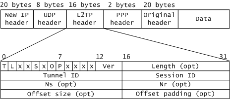

## 计算机网络模型

网络模型一般是指OSI七层参考模型和TCP/IP四层参考模型。这两个模型在网络中应用最为广泛。

### OSI模型(Open System Interconnection Reference Model)

### TPC/IP模型

TCP/IP 协议族常用协议：

应用层：TFTP，HTTP，SNMP，FTP，SMTP，DNS，Telnet 等等。

传输层：TCP，UDP。

网络层：IP，ICMP，OSPF，EIGRP，IGMP。

数据链路层：SLIP，CSLIP，PPP，MTU。

ref :  
[TCP/IP网络参考模型](https://blog.csdn.net/m0_49864110/article/details/127717028)  
[网络模型（看这一篇就够了）](https://blog.csdn.net/troubleshooter/article/details/122376824)

## L2TP协议

第二层隧道协议（：Layer Two Tunneling Protocol，缩写为L2TP）是一种虚拟隧道协议，通常用于虚拟专用网。L2TP协议自身不提供加密与可靠性验证的功能，可以和安全协议搭配使用，从而实现数据的加密传输。经常与L2TP协议搭配的加密协议是IPsec，当这两个协议搭配使用时，通常合称L2TP/IPsec。

### 协议结构

L2TP报文头中标记为可选（opt）的字段，是指在数据消息中可选，在控制消息中则是必选的。

<table cellpadding="4" cellspacing="0" summary="" frame="border" border="1" rules="all">
 <thead align="left">
 <tr>
 <th>字段</th>
 <th>长度</th>
 <th>描述</th>
 </tr>
 </thead>
 <tbody>
 <tr>
 <td>T</td>
 <td>1比特</td>
 <td>类型（Type），取值为“0”时表示数据消息，取值为“1”时表示控制消息。</td>
 </tr>
 <tr>
 <td>L</td>
 <td>1比特</td>
 <td>长度在位标志，取值为“1”时表示报文头中存在长度字段Length。控制消息中必须为“1”。</td>
 </tr>
 <tr>
 <td>x</td>
 <td>1比特</td>
 <td>保留位</td>
 </tr>
 <tr>
 <td>S</td>
 <td>1比特</td>
 <td>顺序字段在位标志，取值为“1”时表示报文头中存在Ns和Nr字段。控制消息中必须为“1”。</td>
 </tr>
 <tr>
 <td>O</td>
 <td>1比特</td>
 <td>取值为“1”时表示报文头中存在offset size字段。控制消息中必须为“0”。</td>
 </tr>
 <tr>
 <td>P</td>
 <td>1比特</td>
 <td>优先级（Priority），只用于数据消息。控制消息中必须为“0”。</td>
 </tr>
 <tr>
 <td>Ver</td>
 <td>4比特</td>
 <td>版本号，对于L2TPv2协议取值为“2”。</td>
 </tr>
 <tr>
 <td>Length</td>
 <td>16比特</td>
 <td>消息的总长度，单位为字节。</td>
 </tr>
 <tr>
 <td>Tunnel ID</td>
 <td>16比特</td>
 <td>隧道标识符，只具有本地意义。Hello控制消息具有全局性，其Tunnel ID必须为0。 </td>
 </tr>
 <tr>
 <td>Session ID</td>
 <td>16比特</td>
 <td>会话标识符，只具有本地意义。</td>
 </tr>
 <tr>
 <td>Ns</td>
 <td>16比特</td>
 <td>当前消息的顺序号。</td>
 </tr>
 <tr>
 <td>Nr</td>
 <td>16比特</td>
 <td>希望接收的下一条控制消息的顺序号。数据消息中是保留字段。</td>
 </tr>
 <tr>
 <td>Offset size</td>
 <td>16比特</td>
 <td>偏移值，指示载荷数据开始的位置。</td>
 </tr>
 <tr>
 <td>Offset padding</td>
 <td>16比特</td>
 <td>填充位。</td>
 </tr>
 </tbody>
 </table>

### l2tp的协商

LAC（L2TP Access Concentrator，L2TP访问集中器）: 是L2TP的隧道端点之一。LAC与LNS互为L2TP隧道的对等节点，L2TP隧道在LAC和LNS之间建立，由LAC和LNS共同维护。

LNS（L2TP Network Server, L2TP网络服务器）：是PPP端系统上用于处理L2TP协议服务器端部分的设备。
它作为L2TP隧道的另一侧端点，是LAC的对端设备，是被LAC进行隧道传输的PPP会话的逻辑终止端点。

① 1(SCCRQ)Start-Control-Connection-Request

      控制链接发起请求，由LAC或LNS向对端发送，用来初始化LAC和LNS之间的tunnel，开始tunnel的建立过程。

②  2(SCCRP)Strat-Control-Connection-Reply

      表示接受了对端的连接请求，tunnel的建立过程可以继续。

③  3(SCCCN)Start-Control-Connection-Connected

       对SCRRP的回应，完成tunnel的建立。

④  ZLB

      零长度消息报文，一般为查询报文，LAC可以用Hello报文进行恢复，也可以直接丢弃。

⑤  10(ICRQ)Incoming-Call-Request

       当LAC检测到有用户拨入电话的时候，向LNS发ICRQ，请求在已建立的tunnel中建立session。

⑥  11(ICRP)Incoming-Call-Reply

      用来回应ICRQ，表示ICRQ成功，LNS也会在ICRP中标识L2TP session必要的参数。

⑦  12(ICCN)Incoming-Call-Connected

      用来回应ICRP，L2TP session建立完成。

ref :  
[l2tp client initial 协商报文分析]([https://blog.csdn.net/qq_47529104/article/details/124648600)
[L2TP协议介绍](https://forum.huawei.com/enterprise/zh/thread/580932541957947392)